# PoP Modeler
______________________________________________________________

## **Overview**
PoP modeler is a tool used to manage and model large, complex, and dynamic business processes

## **Business Alliance Management**

#### Show Alliance Member
This session is used to read/register/update/delete possible alliance members in which you have to register:

- Name
- CNPJ
- Zip Code
- Street
- Number
- Neighborhood
- City
- State
- Country
- Site
- Category

In order to start registering the alliance members click on the "+" button
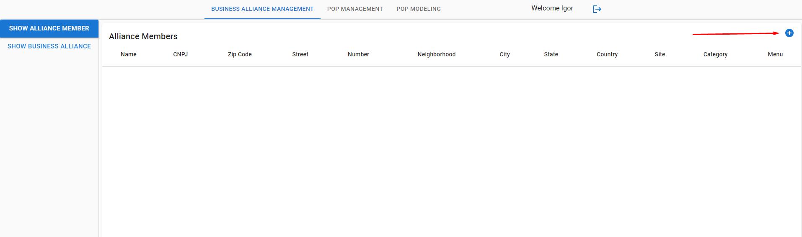

Then you will fill out the form as it follows with your information, when you are finished click on the submit button:

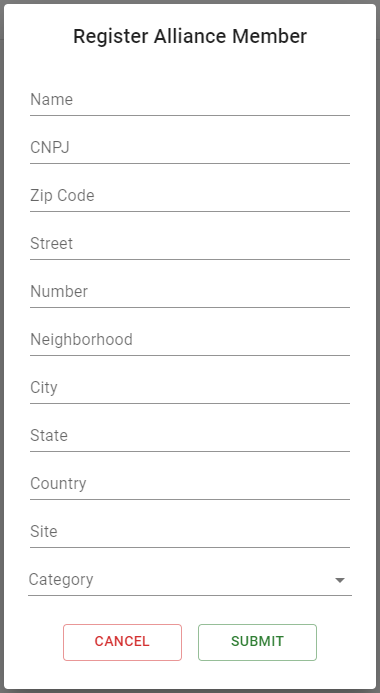 **->** 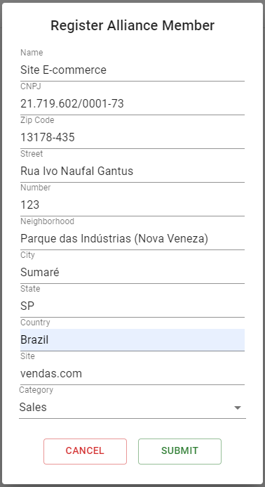

**Congratulations** You have just registered your first Alliance member

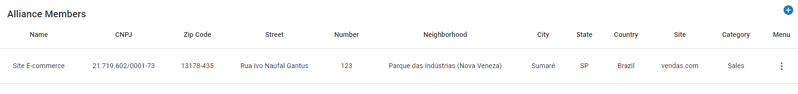

If you have filled out the information wrongly, you can go to the menu section and choose to update or delete your information:

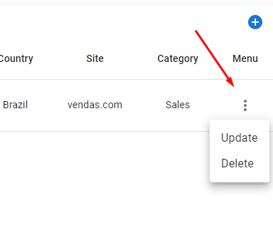

_____________________________________________________________________________________________________________________________________

#### Show Business Alliance
In this session you can start building your Business alliances in which you have to register:

- Name
- Business Goal
- Responsible member
- Corresponding members of the alliance
    - Entry Date
    - Relationship

Also you are able to update and delete and add new internal and external collaborations and manage permissions.

In order to start creating your business alliances click on the "+" button after you've entered the show business alliance session:

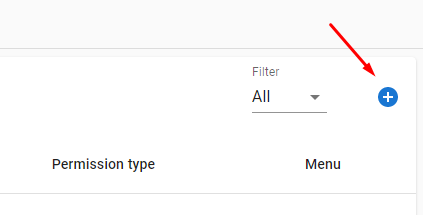

Then you will fill out the form as it follows with your information:

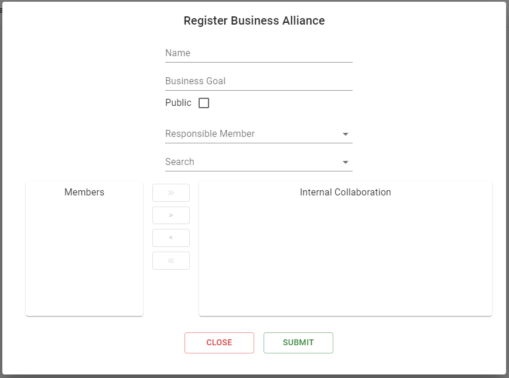 **->** 

You can use the search bar to find specific members that are eligible to join your business alliance 

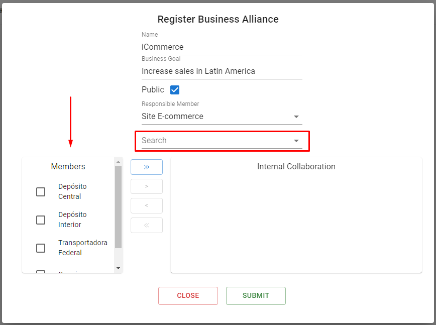

You can also dynamically move the members that are going to participate in the alliance and the ones that won't

Click "**>>**" To move all the members that are being shown to your internal collaboration, those are the ones that will participate in your alliance

Click "**>**" To move all the members that are selected to your internal collaboration, those are the ones that will participate in your alliance

Click "**<<**" To move back all the members that are being shown in your internal collaboration, they won't be participating in the alliance anymore if you do it

Click "**<**" To move back all the members that are selected in your internal collaboration, they won't be participating in the alliance anymore if you do it

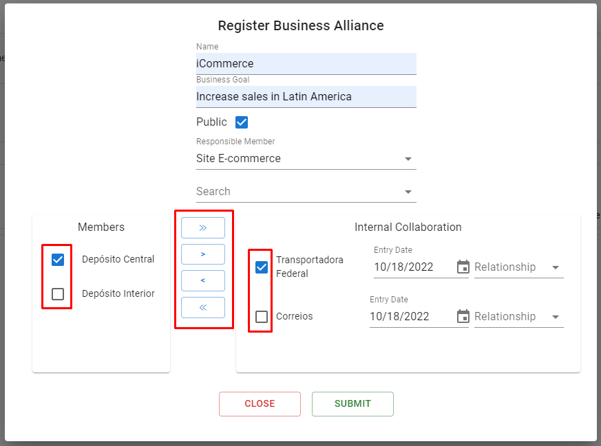

After clicking on submit **you will have created a new alliance member!** 

You can also **filter** the business alliances using:

1. Public
2. Invites (The ones you were invited to)
3. Owner (The ones you are the owner)

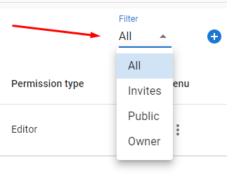

##### Internal Collaboration
You can update/delete internal collaborations, when you delete an internal collaboration the register of the internal collaboration is kept and only an exit date is added.
Also when you Update an Internal Collaboration relationship the older one is kept with an exit date a day before the date you made the update.

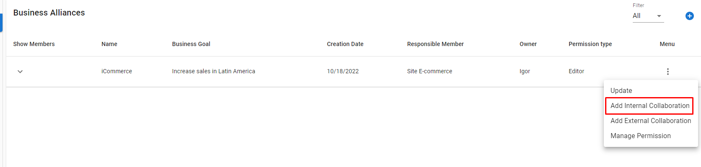

Example of new Internal Collaboration:

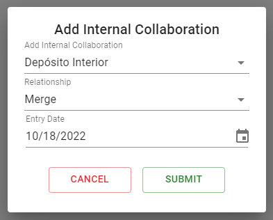

##### External Collaboration
**Yet to come**

## **PoP Management**

#### Show Business Process Model

In this session you are able to register/update/delete multiple business process models for previous registered alliance members, in order to register you have to insert the following informations:

- Name
- A .bpmn file
- Description

To start registering a business process model you have to click on the "*+*" button on the alliance member you want to add.

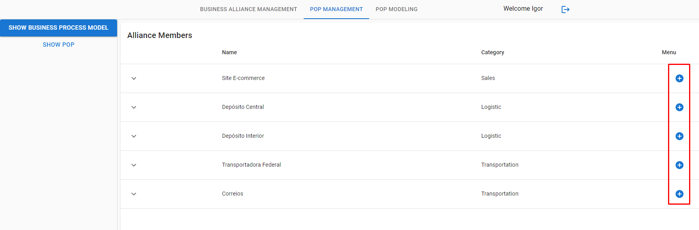

After you've clicked to add your business process model, fill out the form as it follows:

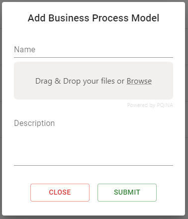 **->** 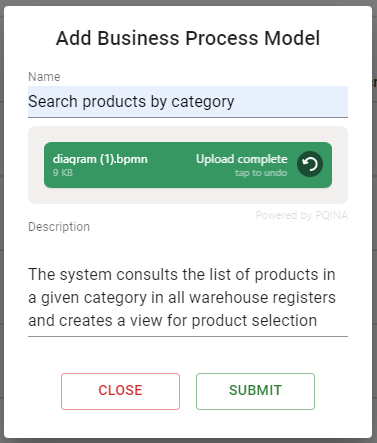

**Don't forget to click to upload your file**

You can also Update and delete your BPMN's

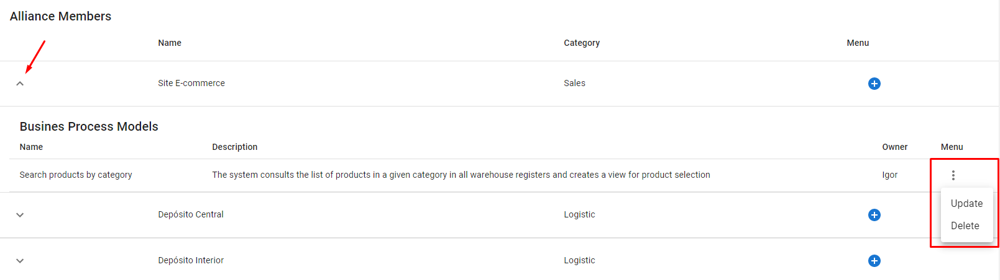 

#### Show PoP
In this session you can start adding the PoPs for your respective business alliances, the following informations must be registered

- Name
- Description
- PoP missions
    - Mission Title
    - Mission Description

You can start adding your pop by clicking on the "**+**" button:

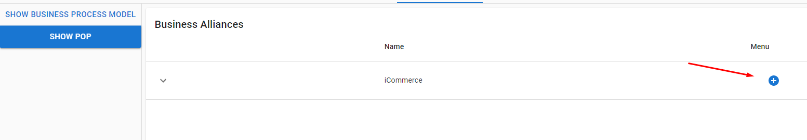 

Then you will fill out the form with your PoP information:

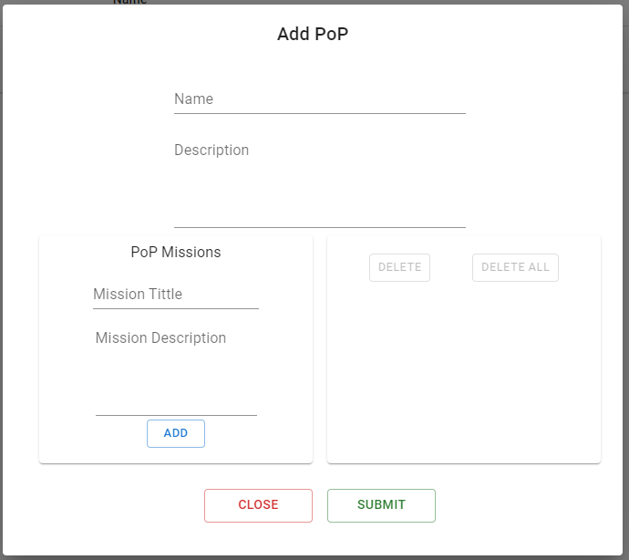 

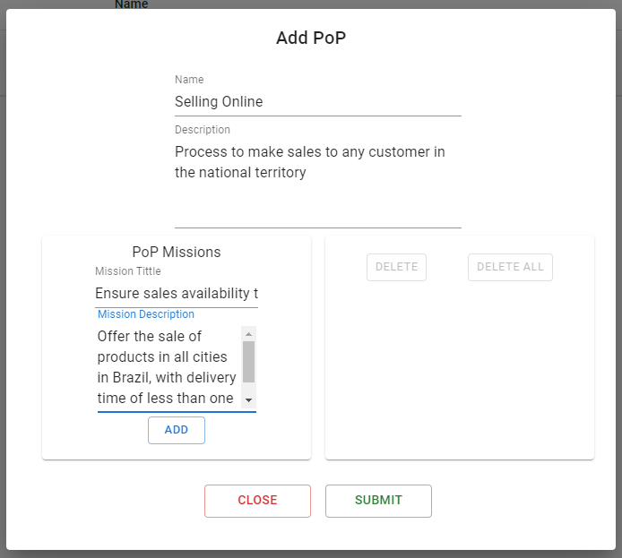 

After filling the mission information and clicking on **add** you will be adding a mission to your PoP:

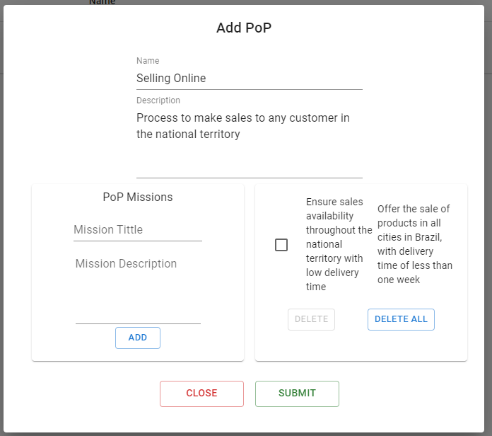 

After you click on "**Submit**" you will have created a PoP 

##### PoP Mission
For each mission you can add constituent Processes from the internal collaboration in the business alliance.

## **PoP Modeling**

#### Yet to come