# PoP Modeler
______________________________________________________________

## **Overview**
PoP modeler is a tool used to manage and model large, complex, and dynamic business processes

## **Business Alliance Management**

#### Show Alliance Member
This session is used to read/register/update/delete possible alliance members in which you have to register:

- Name
- CNPJ
- Zip Code
- Street
- Number
- Neighborhood
- City
- State
- Country
- Site
- Category

In order to start registering the alliance members click on the "+" button

Then you will fill out the form as it follows with your information, when you are finished click on the submit button:

 **->** 

**Congratulations** You have just registered your first Alliance member

If you have filled out the information wrongly, you can go to the menu section and choose to update or delete your information:

_____________________________________________________________________________________________________________________________________

#### Show Business Alliance
In this session you can start building your Business alliances in which you have to register:

- Name
- Business Goal
- Responsible member
- Corresponding members of the alliance
    - Entry Date
    - Relationship

Also you are able to update and delete and add new internal and external collaborations and manage permissions.

In order to start creating your business alliances click on the "+" button after you've entered the show business alliance session:

Then you will fill out the form as it follows with your information:

 **->** 

You can use the search bar to find specific members that are eligible to join your business alliance 

You can also dynamically move the members that are going to participate in the alliance and the ones that won't

Click "**>>**" To move all the members that are being shown to your internal collaboration, those are the ones that will participate in your alliance

Click "**>**" To move all the members that are selected to your internal collaboration, those are the ones that will participate in your alliance

Click "**<<**" To move back all the members that are being shown in your internal collaboration, they won't be participating in the alliance anymore if you do it

Click "**<**" To move back all the members that are selected in your internal collaboration, they won't be participating in the alliance anymore if you do it

After clicking on submit **you will have created a new alliance member!** 

You can also **filter** the business alliances using:

1. Public
2. Invites (The ones you were invited to)
3. Owner (The ones you are the owner)

##### Internal Collaboration
You can update/delete internal collaborations, when you delete an internal collaboration the register of the internal collaboration is kept and only an exit date is added.
Also when you Update an Internal Collaboration relationship the older one is kept with an exit date a day before the date you made the update.

Example of new Internal Collaboration:

##### External Collaboration
**Yet to come**

## **PoP Management**

#### Show Business Process Model

In this session you are able to register/update/delete multiple business process models for previous registered alliance members, in order to register you have to insert the following informations:

- Name
- A .bpmn file
- Description

To start registering a business process model you have to click on the "*+*" button on the alliance member you want to add.

After you've clicked to add your business process model, fill out the form as it follows:

 **->** 

**Don't forget to click to upload your file**

You can also Update and delete your BPMN's

 

#### Show PoP
In this session you can start adding the PoPs for your respective business alliances, the following informations must be registered

- Name
- Description
- PoP missions
    - Mission Title
    - Mission Description

You can start adding your pop by clicking on the "**+**" button:

 

Then you will fill out the form with your PoP information:

 

 

After filling the mission information and clicking on **add** you will be adding a mission to your PoP:

 

After you click on "**Submit**" you will have created a PoP 

##### PoP Mission
For each mission you can add constituent Processes from the internal collaboration in the business alliance.

## **PoP Modeling**

#### PoP Overall View 

This session is used to visualize and manage PoP Overall models.

In order to generate a PoP overall model you have to start clicking on the PoP Overall Model Button

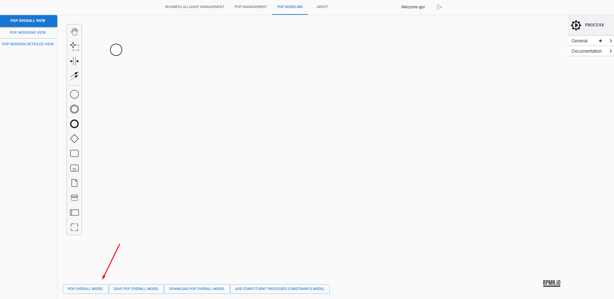 

After that you can visualize a list of Business Alliances and their PoPs, then you can choose which PoP you want to generate a model and click on the Create new PoP Overall Model button. (If you have a previous saved Overall Model you can load it on the Load PoP Overall Model button)

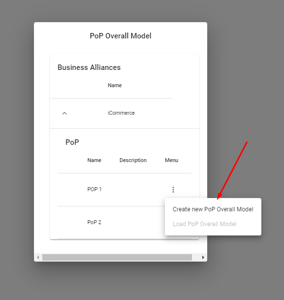 

Then you will have the Overall model generated

 

You can also save and download the generated Overall Model on the following buttons

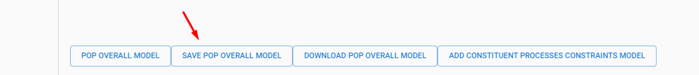 

 

And to finish the Overall view you can add the constraints model

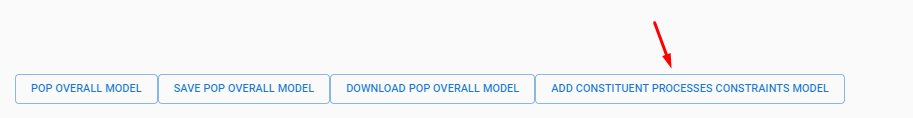 

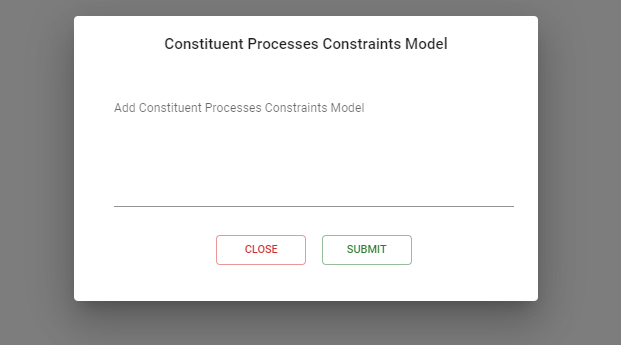 

#### PoP Missions View 

This session is used to visualize and manage the PoP Missions Model.

To generate a PoP Mission Model it's very similar to PoP Overall models, you will click on the button PoP Mission Model

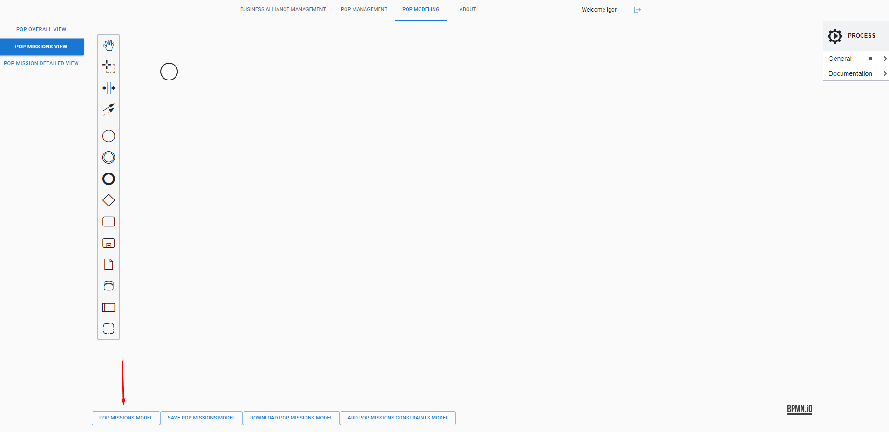 

After that you can visualize a list of Business Alliances and their PoPs, then you can choose which PoP you want to generate a model and click on the Create new PoP Missions Model button. (If you have a previous saved Missions Model you can load it on the Load PoP Missions Model button)

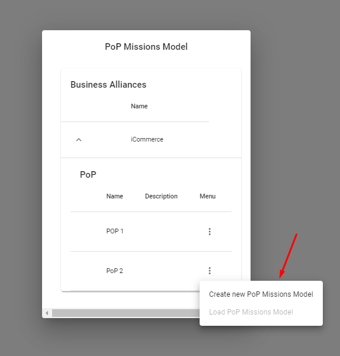 

Then you will have the Missions Model generated

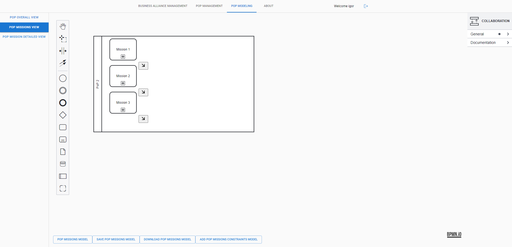 

You can also save and download the generated model on the following buttons

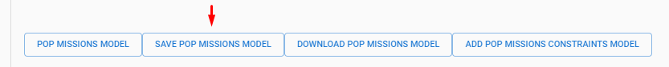 

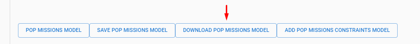 

Then you also have the option of adding constraints

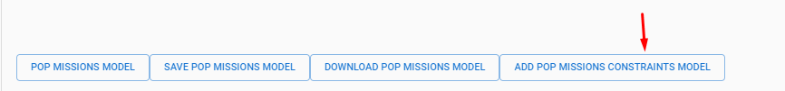 

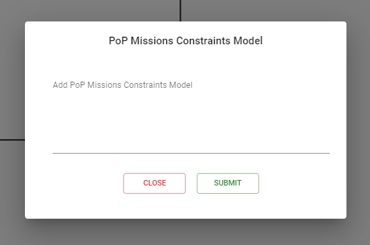 

#### PoP Mission Detailed View 

This session is used to visualize and manage the PoP Mission Detailed Models.

To generate a PoP Mission Detailed Model it's very similar to PoP Overall models, you will click on the button PoP Mission Detailed Model

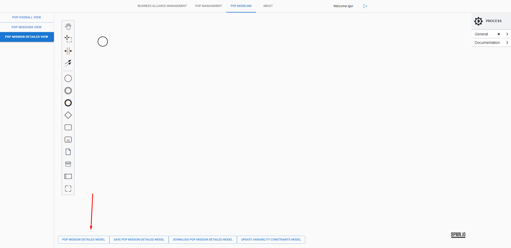 

After that you can visualize a list of Business Alliances and their PoPs, then you can choose which PoP Mission you want to generate a model and click on the Create new PoP Detailed Model button. (If you have a previous saved Mission Detailed Model you can load it on the Load PoP Detailed Model button and if you have a Model on your local machine you can Upload it on the Upload PoP Detailed Model Button)

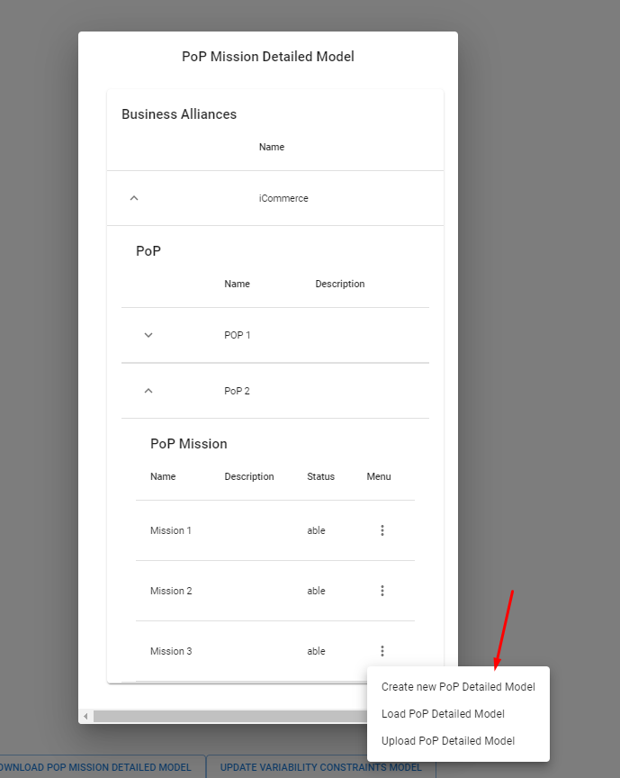 

Then you will have the Mission Detailed Model generated

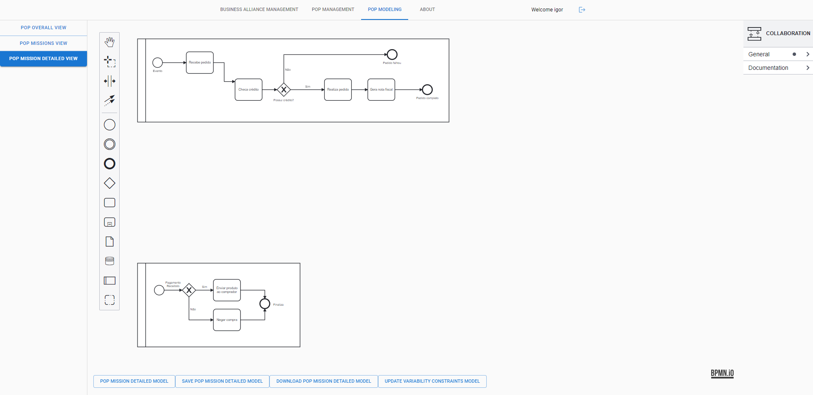 

You can also save and download the generated model on the following buttons

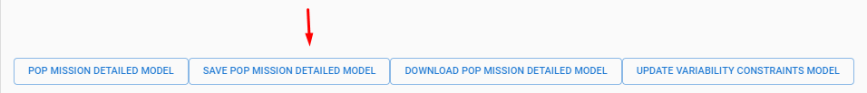 

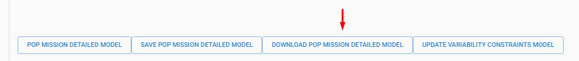 

Then you also have the option of adding variability constraints

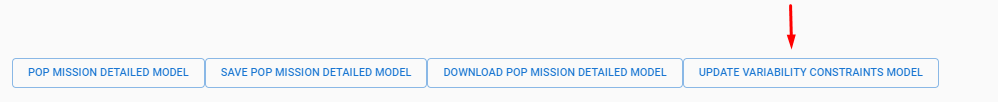 

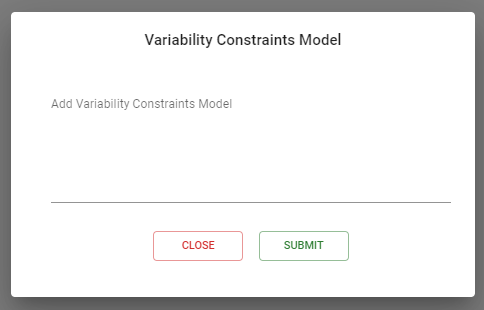 

## **Especificação de Requisitos**

### 1 Introdução

 Este documento registra os requisitos gerais da ferramenta PoPModeler, na forma de requisitos textuais do produto.
 

### 2 Visão Geral do Sistema

 
A ferramenta PoPModeler trata do gerenciamento dos Processos-de-Processos (CAGNIN; NAKAGAWA, 2021) de alianças de organizações. Para facilitar a compreensão e o desenvolvimento da ferramenta, ela é dividida em módulos: Gerenciamento de Alianças de Negócio (Business Alliance Management), Gerenciamento do PoP (PoP Management) e Modelagem do PoP (PoP Modeling). O módulo Gerenciamento de Aliança de Negócio permite o gerenciamento e a visualização das organizações e das Alianças de Negócios cadastradas. O módulo Gerenciamento do PoP permite o gerenciamento dos modelos de processo de negócio das organizações e o gerenciamento do PoP das Alianças de Negócio O módulo Modelagem do PoP possibilita ... 

### 3 Classes de usuários

 Na presente seção devem ser descritas as várias classes de usuário relevantes para o sistema. 

 Usuário – Tem a permissão para realizar a maior parte das funcionalidades do sistema.
 

### 4 Definição de conceitos

 
Nesta seção são descritos os principais conceitos relevantes para o domínio do sistema.
Alliance Member – membro cadastrado pelo usuário, contendo os atributos CNPJ, nome, CEP, rua, número, bairro, cidade, estado, país, site, categoria.
 

 Business Alliance – Aliança composta por um membro responsável, contendo seu nome, objetivo, data de criação, colaborações internas e colaboração externas. Cada colaboração interna contém seu nome, o tipo de relação com a organização responsável  e a data de entrada e saída da aliança. Cada colaboração externa contém seu nome, o tipo de relação com a organização responsável, visão do negócio  e a data de entrada e saída da aliança. 

 Category - Categoria do membro que representa o seu papel na aliança podendo ser previamente cadastrado.
 

 Relationship- Tipo de relacionamento que um membro tem com uma aliança, podendo ser: responsible, merge, acquisition, partnership.
 

 Internal Collaboration - ???
 

 External Collaboration  - ???
 

### 5 Requisitos de Software

 Nesta seção são descritos os requisitos textuais do produto. Na Seção 5.1 são descritos os requisitos funcionais. Na Seção 5.2 são descritos os requisitos não-funcionais.
 

#### 5.1 Requisitos funcionais  
**Gerenciamento de Alianças de Negócio:**

RF-1. O sistema deve permitir a inclusão, alteração e remoção de membros da aliança, com os seguintes atributos: nome, CNPJ, cep, rua, número, bairro, cidade, estado, país, site, categoria. Uma organização não poderá ser removida se fizer parte de uma aliança. 

 
RF-2. O sistema deve permitir a inclusão e alteração de alianças de negócios, contendo os atributos: nome, objetivo, data, organização responsável e colaborações internas e externas, sendo que cada colaboração possui os atributos: nome, data de entrada, data de saída e tipo de relação (Merge, Partnership, Acquisition). Quando o atributo tipo de relação for alterado deve ser adicionada uma nova organização membro com o atributo tipo de relação anterior e a data de saída deve ser 1 dia a menos que a data de entrada da nova relação. Se existir o atributo data de saída, a organização membro não poderá ser removida e o atributo tipo de relação não poderá ser alterado. 

**Relatórios:**

 
RF-3. O sistema deve permitir a visualização de uma lista contendo as organizações cadastrados com as seguintes informações:  nome, CNPJ, cep, rua, número, bairro, cidade, estado, país, site, categoria.

 RF-4. O sistema deve permitir a visualização de uma lista de alianças de negócios cadastradas, apresentando as seguintes informações: nome, objetivo, data, organização responsável e colaboração interna e externa, sendo que cada colaboração tem os atributos: nome, data de entrada, data de saída e tipo de relação. 

**Gerenciamento do PoP:**

 RF-5. O sistema deve permitir upload dos processos de negócio de uma organização, armazenando título e descrição..
 

 RF-6. O sistema deve permitir a inclusão, alteração e remoção de um determinado PoP em uma aliança de negócio  com os seguintes atributos: identificador, nome e a aliança associada. 

 
RF-7. O sistema deve permitir a inclusão, alteração e remoção de missões de um determinado PoP. Cada missão representa um objetivo estratégico da aliança no nível de processo de negócio. 

 RF-8. O sistema deve permitir a inclusão de processos constituintes das organizações membro da aliança de negócio em uma determinada missão de um PoP da aliança de negócio. Para isso, o sistema deve listar as organizações (e seus respectivos processos de negócio) de uma determinada aliança. O sistema deve permitir selecionar os processos constituintes necessários para cumprir uma determinada missão. É necessário ter ao menos dois processos constituintes de organizações distintas para cumprir cada missão. 

#### 5.2      Requisitos não-funcionais

**Disponibilidade:**

 RNF-1.        O sistema deve estar disponível 24hs por dia, 7 dias por semana.

**Usabilidade:**

 RNF-2.        O sistema deve ser fácil de aprender e fácil de se usar. 

**Portabilidade:**

 RNF-3.        O sistema deve ser capaz de armazenar os dados na base de dados do sistema de gerenciamento de banco de dados Postgre. 

#### 5.3   Pré-requisitos tecnológicos  
nodeJS, PHP, Composer, Postgre

#### 5.4   Configuração

Front-end: npm install

Back-end: composer install, você deve configurar o arquivo .env 

### 6 Histórico de versões do documento

Essa seção apresenta o histórico de versões desse documento.

| Versão        | Publicação    | Autor(es)                                           | Ações realizadas                                           |
| ------------- | ------------- | --------------------------------------------------- | ---------------------------------------------------------- |
| 1.0           | 05/10/2021    | Wellington Gabriel de Mattia                        | ‐ Versão inicial do documento de requisitos.               |
| 2.0           | 25/11/2021    | Maria Istela Cagnin e Murilo Costa                  | - Descrição dos requisitos do módulo Gerenciamento do PoP. |

**Referências**

 CAGNIN, Maria Istela; NAKAGAWA, Elisa Yumi. Towards dynamic processes-of-business processes: a new understanding. Business Process Management Journal, v. 27, n. 5, p. 1463-7154, 08 dez. 2021. 

## **Modelo Conceitual**

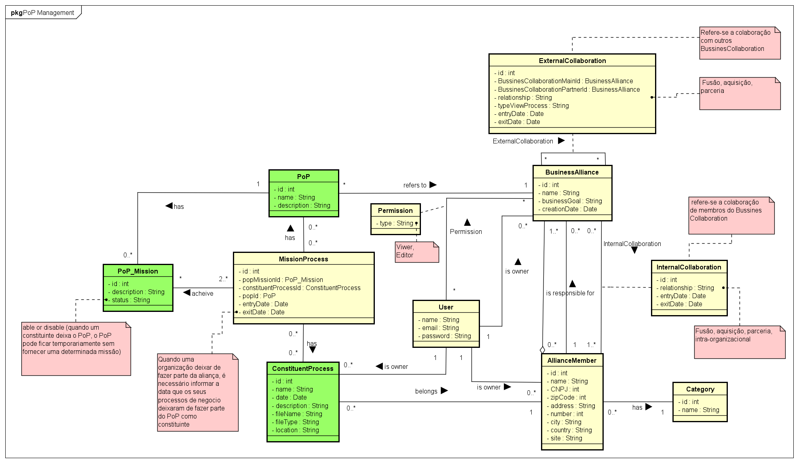 
